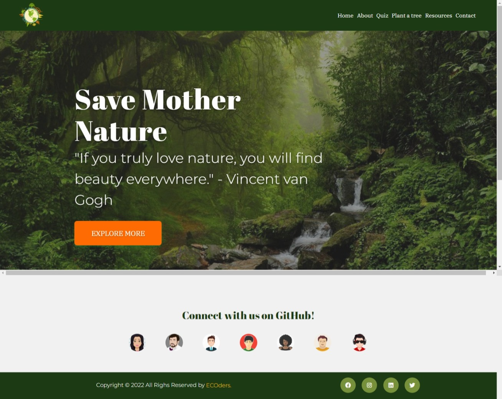
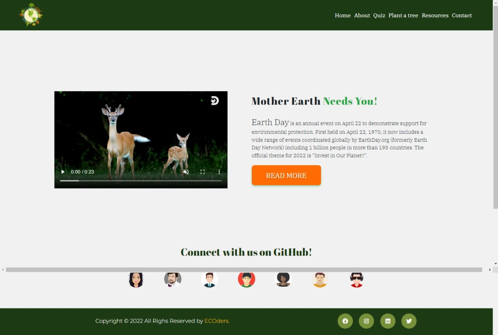

# Mother Earth
 Mother Earth has been developed as part of Code Institute's April 2022 Hackathon.
Mother earth helps you plan for a more sustainable future in a playful way through simple tips, quiz, events, rewards.
By raising self-awareness we can enable peole to reconnect to themselves ,reconnect to nature and truly comprehend humanity's impact on the planet by creating
a quiz app feature, tree planting donation feature and some extra resources.
The team members for this project were: Nigel Doberer, Salwin Achankunju_5P, Yusuf F, Jochen Mayer, Eugenia Muscat & Sandra Atino under the guidance of our facilitator, DaveHorrocks_ci.

Deployed website can be viewed [here](http://mother-earth-hackathon.herokuapp.com/).

## Project Goals

## UX Design

### Site Owner Goals

### User Stories
- As a user, I want to understand the purpose of the site easily.
- As a user, I want to navigate throughout the site easily and efficiently.
- As a user, I want to experience responsive design, so I can use the site on different devices.
- As a user, I want to find easy to understand content about sustainability 
- As a user, I want to enjoy simple and streamlined design that emulates the purpose of the site.
- As a user, I want to enjoy images that reflect the aim of the site and convey the idea of a beautiful earth
- As a user, I want to find social media links so i can easily reach out to the company for any queries.
- As a user, I want to receive rewards based on my wins playing the quiz.

### **Existing Features**
* **Responsive design** - the site has been developed using Bootstrap and custom CSS to ensure the site is responsive across all devices.

* **Header**
    
    • This section features the logo of the website and when it is clicked the user is navigated back to the home page.
    • It displays the navigation bar with list elements i.e., Home, About, Quiz, Plant a tree, Resources and Contact.
    • Hover effect at navigation elements gives a good user interaction experience with a bold blue underlining feature.

* **Landing Page**
    
    • The image and the content give a clear message to the user to think about how beautiful our nature is, and we could we lose all for worse if we don’t take care of it.
    • The ‘EXPLORE MORE’ button navigates the user to the About page.

* **Footer**
    
    • There are the avatars of the team members and facilitator who have worked towards the development of this website, and they can be connected at their GitHub platform.
    • There a hover effect on each avatar which pops up the name of the team members.
    • A copyright statement with team name as ECOders.
    • Social media links to follow the Mother earth website.

* **About Page**
    
    • This page gives the user a short details o the Earth Day and a fun fact about Mother Earth through a short video and text content.
    • The ‘READ MORE’ button navigates the user to an external webpage with more details on Mother Earth.

### Wireframes
The wireframes for this project were developed using [Balsamiq](https://balsamiq.com/).

* **Desktop Wireframes:**
        
     
     
    ![About page]

* **Mobile Wireframes:**

       
      

### Changes to Wireframes
## Design

### Structure

A simple clean design with easy to use buttons handles the navigation throughout the app.

### Colour Scheme

### Images
 * All images used are from pexels ,freepik and are free to used for educational purposes.
 * attributes

### Typography

 [Google Fonts](https://fonts.google.com/) was used to select the fonts.
  * The main font used throughout the site is '---------' which belongs to the sans-serif typeface family. The font is clean and elegant, making it a good choice for web design.

 * We have used the '---------------' font for titles and headers all over the site.

 * Sans Serif is set as the fallback font if for any reason the main fonts aren't being imported into the site correctly.

## Technologies

### Languages
- HTML
- CSS3
- JavaScript
- Python

### Frameworks and Libraries
- hover css
- animate.css

- [Am I Responsive?](http://ami.responsivedesign.is/) was used to create the mock ups.
- [Balsamiq](https://balsamiq.com/) was used to create the wireframes.
- [Bootstrap 5.1.3](https://getbootstrap.com/) was used to contribute to responsiveness and styling of the site.
- [Font Awesome](https://fontawesome.com/) was used for the icons.
- Git was used for version control ad to push code to GitHub.
- [GitHub](https://github.com/) was used to store the repository.
- [GitPod](https://www.gitpod.io/) was used as the IDE to develop the project.
- [GitHub Projects]() was used to manage the workflow of the project.
- [Google Fonts](https://fonts.google.com/) were used to select fonts for the site.

## Testing

### [HTML Validator:](https://validator.w3.org/)

### [CSS Validator:](https://jigsaw.w3.org/css-validator/)

### [JSHint:](https://jshint.com/)

### [Python Syntax Checker PEP8](https://www.pythonchecker.com/)

### Lighthouse: 

## Bugs
• Quiz Page - Body contents and footer overlapping each other for smaller screen size.
• Contact Page – The Submit button initiates the thank you message popup even with empty text fields. 

## Deployment

The following steps were followed to deploy the project to a live website in GitHub, using Github Pages:

- Ensure changes have been added and commited in Gitpod and pushed to GitHub.
- Login to GitHub.
- Locate the relevant repository on GitHub. This is the repository for...
- At the top of the repository, locate the 'Settings' link and click on this.
- On the left of the page, under Options, scroll down until you get to Pages and click on Pages.
- Under Source, in the first box called "None", click the dropdown and select "master".
- Then select Save.
- The page will refresh and you will see a link above the Save button. This is the link to the live site. Note that it may take a few minutes for the site to be deployed.
- There are no differences between the deployed version and the development version of this project.

### Forking the GitHub Repository
The repository can be forked on GitHub, this creates a copy of the repository that can be viewed or amended without affecting the original repository. This can be done using the following steps:

- Login to GitHub and locate the repository as before.
- At the top right of the repository (under your avatar) locate the Fork button and click this button.
- There should now be a copy of the repository in your own GitHub account, which you can amend.

### Cloning the GitHub Repository
A clone of the repository can be made, which will create a local copy on your own computer. Changes can be made to this local copy and it will not affect the original repository. Follow these steps to clone the Sunrise Yoga repository.

- Login to GitHub and locate the repository as before.
- Click the button called "Code".
- Under HTTPS copy the link provided, in this case ().
- Go to Gitpod or whichever IDE you are using and open the Terminal.
- Change the current working directory to the location where you want the cloned directory to be made.
- Type 'git clone' followed by the url you copied in step 3.
- Press "Enter" to create the local clone.
- You can refer to the GitHub documentation for more detailed information on the above process [here](https://docs.github.com/en/github/creating-cloning-and-archiving-repositories/cloning-a-repository).

## Credits

### Content

#### Website Content
- Quiz content from [Earth day quiz](https://questionsgems.com/earth-day-quiz/)
- Quotes from [david attenborough]()
- Content regarding ways to save our planet modifed from several websites
    
#### Fonts
- Fonts used are from [Google Fonts](https://fonts.google.com/)
- Icons used are from [Font Awesome](https://fontawesome.com/)

#### Code Content

### Media

#### Images
* Hero image used from [Pexels](https://www.pexels.com/@rostislav/)
* importance of tree planting  30s video from[youtube](https://www.youtube.com/watch?v=qY8EfttB6As)
* Logo and banner designed using: [freepik](https://www.freepik.com/search?format=search&query=animatedtoilet&type=vector)
* Hackathon banner designed & modified  from[canva](https://www.canva.com/)
* Images of------ in the ----- section are from google Commons
* Illustrations from [UnDraw](https://undraw.co/illustrations)

#### Audio

## Acknowledegments:
We thank [Code Institute](https://codeinstitute.net/se/5-day-coding-challenge/?utm_term=code%20institute&utm_campaign=CI+-+SWE+-+Search+-+Brand&utm_source=adwords&utm_medium=ppc&hsa_acc=8983321581&hsa_cam=14660337051&hsa_grp=134087657984&hsa_ad=546251838362&hsa_src=g&hsa_tgt=kwd-319867646331&hsa_kw=code%20institute&hsa_mt=e&hsa_net=adwords&hsa_ver=3&gclid=Cj0KCQiArt6PBhCoARIsAMF5wajobw5RmzmDSvl-nqpJtRaVQKF-Znj4iDi1CR3oW-l9rBFnjMP_T1QaAvkOEALw_wcB) for organizing this Hackathon.
* All the Team members
* our Facilitator Dave

