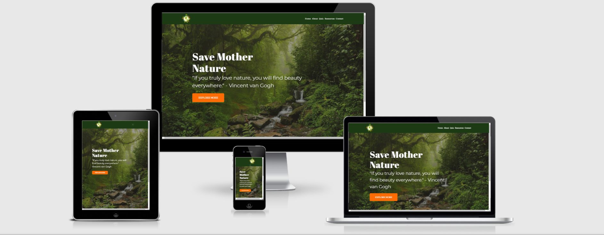
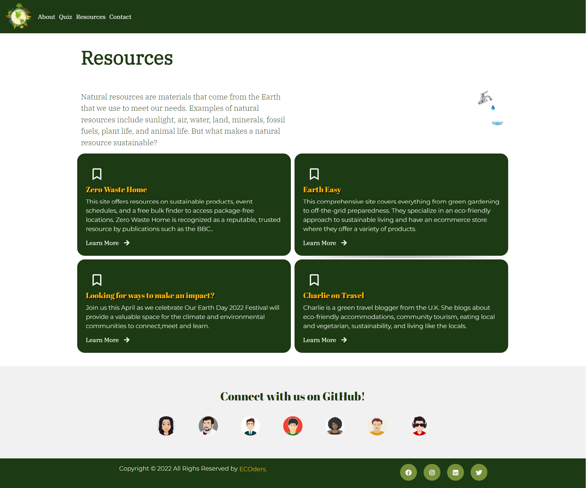
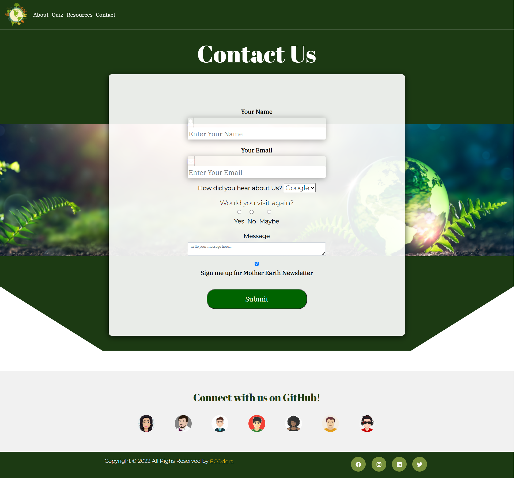
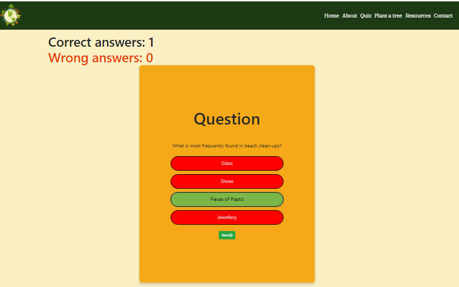
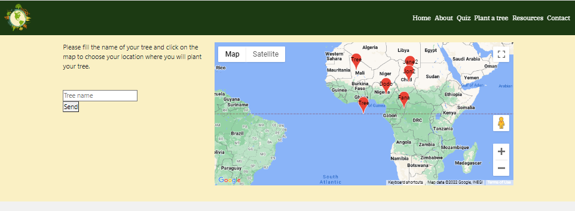
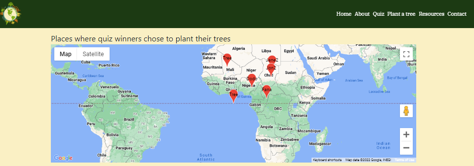
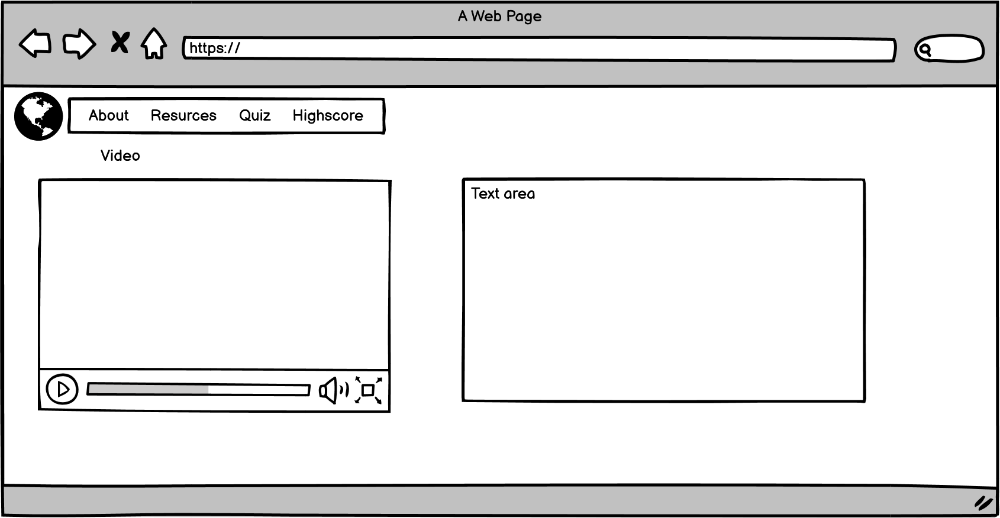
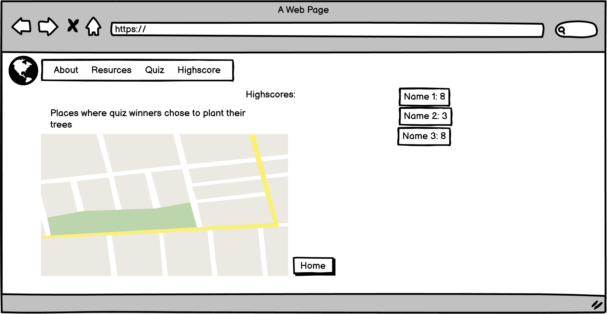

# Mother Earth
 Mother Earth has been developed as part of Code Institute's April 2022 Hackathon.
Mother earth helps you plan for a more sustainable future in a playful way through simple tips, quiz, events, rewards.
By raising self-awareness we can enable peole to reconnect to themselves ,reconnect to nature and truly comprehend humanity's impact on the planet by creating
a quiz app feature, tree planting donation feature and some extra resources.
The team members for this project were: Nigel Doberer, Salwin Achankunju_5P, Yusuf F, Jochen Mayer, Eugenia Muscat & Sandra Atino under the guidance of our facilitator, DaveHorrocks_ci.




Deployed website can be viewed [here](http://mother-earth-hackathon.herokuapp.com/).


## Project Goals


## UX Design

### Site Owner Goals

### User Stories
- As a user, I want to understand the purpose of the site easily.
- As a user, I want to navigate throughout the site easily and efficiently.
- As a user, I want to experience responsive design, so I can use the site on different devices.
- As a user, I want to find easy to understand content about sustainability 
- As a user, I want to enjoy simple and streamlined design that emulates the purpose of the site.
- As a user, I want to enjoy images that reflect the aim of the site and convey the idea of a beautiful earth
- As a user, I want to find social media links so i can easily reach out to the company for any queries.
- As a user, I want to receive rewards based on my wins playing the quiz.


### **Existing Features**
* **Responsive design** - the site has been developed using Bootstrap and custom CSS to ensure the site is responsive across all devices.


* **Header**
    
    • This section features the logo of the website and when it is clicked the user is navigated back to the home page.
    • It displays the navigation bar with list elements i.e., Home, About, Quiz, Plant a tree, Resources and Contact.
    • Hover effect at navigation elements gives a good user interaction experience with a bold blue underlining feature.


* **Landing Page**
    
    • The image and the content give a clear message to the user to think about how beautiful our nature is, and we could we lose all for worse if we don’t take care of it.
    • The ‘EXPLORE MORE’ button navigates the user to the About page.

* **Footer**
    
    • There are the avatars of the team members and facilitator who have worked towards the development of this website, and they can be connected at their GitHub platform.
    • There a hover effect on each avatar which pops up the name of the team members.
    • A copyright statement with team name as ECOders.
    • Social media links to follow the Mother earth website.

* **About Page**
    
    • This page gives the user a short details o the Earth Day and a fun fact about Mother Earth through a short video and text content.
    • The ‘READ MORE’ button navigates the user to an external webpage with more details on Mother Earth.


* **Resources ** - In the resources page there are links to various social earth day links.
    

 about page Gives users a good understanding of why the site exists and what its mission is.


* **Contact page** - The user can reach out to the site owner/business for many querries.
    
* **Quiz page** - The visitors can make a quiz about Earth Day. After they finish the quiz they have the possibility to choose a name and a location on the map for planting their tree.
    

    
* **Plant a tree page** - The visitors can see a map with locations where other users planted their trees.
    
### Wireframes
The wireframes for this project were developed using [Balsamiq](https://balsamiq.com/).

* **Desktop Wireframes:**
        
    Home page
     
    Game page
    
    About page
    
    Highscores
    
    Low score message
    
    Score page max score
    


## Design

### Structure

A simple clean design with easy to use buttons handles the navigation throughout the app.

### Colour Scheme

[shutterstock color palettes](https://www.shutterstock.com/blog/color-palettes-for-websites)


### Images
 * All images used are from pexels ,freepik and are free to used for educational purposes.
 * attributes

### Typography

 [Google Fonts](https://fonts.google.com/) was used to select the fonts.
  * The main font used throughout the site is '---------' which belongs to the sans-serif typeface family. The font is clean and elegant, making it a good choice for web design.

 * We have used the 'Abril + Fatface' font for titles and headers all over the site.

 * Sans Serif is set as the fallback font if for any reason the main fonts aren't being imported into the site correctly.

## Technologies
### Backend functionality
The backend functionality is realized with a combination of Flask, MongoDB and custom made APIs.
The first API endpoint is GET /places which returns a JSON structure containing data from quiz_rewards MongoDB collection.
The second API endpoint is POST /places which receives JSON data from JS and stores the data in the quiz_rewards MongoDB collection.

After the visitor completes the quiz, he/she will land on the /score page.

In there he/she will need to give a name for the tree and choose a location by clicking on the map.

After that, when clicking ```Send```, the JS client side functionality will send a POST API request to /scores containting data about name, latitude, longitude, score.

The backend will store that data in MongoDB.

After calling the POST API, the user is redirected to ```Plant a tree``` view.

The /plant_tree view displays a map showing all the locations where quiz visitors planted the trees.
This is done by a JS functionality which obtains data from GET /score API endpoint and puting pins on the map.

### Languages
- HTML
- CSS3
- JavaScript
- Flask
- Python

### Frameworks and Libraries
- hover css for hover effects through out the site.
- animate.css

- [Am I Responsive?](http://ami.responsivedesign.is/) was used to create the mock ups.
- [Balsamiq](https://balsamiq.com/) was used to create the wireframes.
- [Bootstrap 5.1.3](https://getbootstrap.com/) was used to contribute to responsiveness and styling of the site.
- [Font Awesome](https://fontawesome.com/) was used for the icons.
- Git was used for version control ad to push code to GitHub.
- [GitHub](https://github.com/) was used to store the repository.
- [GitPod](https://www.gitpod.io/) was used as the IDE to develop the project.
- [GitHub Projects]() was used to manage the workflow of the project.
- [Google Fonts](https://fonts.google.com/) were used to select fonts for the site.
- <a href="https://developers.google.com/maps/documentation" target="_blank">Google Maps</a> (used to choose a specific location on the map)
- [MongoDB](https://www.mongodb.com/1) is the fully managed cloud database service used for the project.
- [Heroku](https://dashboard.heroku.com/) is the cloud platform to deploying the app.
- [Flask](https://flask.palletsprojects.com/en/1.1.x/) is the web framework used to provide libraries, tools and technologies for the app.
- [Jinja](https://jinja.palletsprojects.com/en/2.11.x/) is used for Python templating
- [Werkzeug](https://werkzeug.palletsprojects.com/en/1.0.x/) is used for password hashing and authentication and autohorization.

## Testing

### [HTML Validator:](https://validator.w3.org/)


### [CSS Validator:](https://jigsaw.w3.org/css-validator/)


### [JSHint:](https://jshint.com/)


### [Python Syntax Checker PEP8](https://www.pythonchecker.com/)


### Lighthouse: 


## Bugs
• Quiz Page - Body contents and footer overlapping each other for smaller screen size.
• Contact Page – The Submit button initiates the thank you message popup even with empty text fields. 


## Deployment

#### Requirements 
- Python3 
- Github account 
- MongoDB account 
- Heroku account

#### Clone the project 
To make a local clone, follow the following steps. 
1. Log in to GitHub and go to the repository. 
2. Click on the green button with the text **"Code".**
3. Click on **"Open with GitHub Desktop"** and follow the prompts in the GitHub Desktop Application or follow the instructions from **[this link](https://docs.github.com/en/free-pro-team@latest/github/creating-cloning-and-archiving-repositories/cloning-a-repository#cloning-a-repository-to-github-desktop)** to see how to clone the repository in other ways. 

#### Working with the local copy
1. Install all the requirements: Go to the workspace of your local copy. In the terminal window of your IDE type: **pip3 install -r requirements.txt**.
2. Create a database in MongoDB  
    - Signup or login to your MongoDB account.
    - Create a new Database called "mother_earth" in [MongoDB Atlas](https://www.mongodb.com/). .
    - In the "mother_earth" database create the **quiz_rewards** collection.
        ###### quiz_rewards
        ```
        {
            _id: <ObjectId>,
            name: <String>,
            lat: <Decimal>,
            lng: <Decimal>,
            score: <Integer32>,
        }
3. Create the environment variables 
    - Create a .gitignore file in the root directory of the project.
    - Add the env.py file in the .gitignore.
    - Create the file env.py. This  will contain all the environment variables.
    ```
    import os
    os.environ.setdefault("IP", "Added by developer")
    os.environ.setdefault("PORT", "Added by developer")
    os.environ.setdefault("SECRET_KEY", "Added by developer")
    os.environ.setdefault("MONGO_URI", "Added by developer")
    os.environ.setdefault("MONGO_DBNAME", "Added by developer")
    ```
4. Run the app: Open your terminal window in your IDE. Type python3 app.py and run the app.

#### Heroku Deployment  
1. Set up local workspace for Heroku 
    - In terminal window of your IDE type: ```pip3 freeze -- local > requirements.txt.``` (Heroku detects this as a Python app. The reason that they've been able to detect Python is because we have a requirements.txt file)

    - In terminal window of your IDE type: ```echo "python app.py" > Procfile``` (The file is needed for Heroku to know which file is needed as entry point.)
1. Set up Heroku: create a Heroku account, create a new app and select your region. 
2. Deployment method 'Github'
    - Click on the **Connect to GitHub** section in the deploy tab in Heroku. 
        - Search your repository to connect with it.
        - When your repository appears click on **connect** to connect your repository with the Heroku. 
    - Go to the settings app in Heroku and go to **Config Vars**. Click on **Reveal Config Vars**.
        - Enter the variables contained in your env.py file. it is about: **IP, PORT, SECRET_KEY, MONGO_URI, MONGO_DBNAME**
3. Push the requirements.txt and Procfile to the repository. 
     ```
    $ git add requirements.txt
    $ git commit -m "Add requirements.txt"

    $ git add Procfile 
    $ git commit -m "Add Procfile"
    ```
4. Automatic deployment: Go to the deploy tab in Heroku and scroll down to **Automatic deployments**. Click on **Enable Automatic Deploys**. By **Manual deploy** click on **Deploy Branch**.

Heroku will receive the code from Github and host the app using the required packages. 
Click on **Open app** in the right corner of your Heroku account. The app wil open and the live link is available from the address bar. 


### Forking the GitHub Repository
The repository can be forked on GitHub, this creates a copy of the repository that can be viewed or amended without affecting the original repository. This can be done using the following steps:

- Login to GitHub and locate the repository as before.
- At the top right of the repository (under your avatar) locate the Fork button and click this button.
- There should now be a copy of the repository in your own GitHub account, which you can amend.

### Cloning the GitHub Repository
A clone of the repository can be made, which will create a local copy on your own computer. Changes can be made to this local copy and it will not affect the original repository. Follow these steps to clone the Sunrise Yoga repository.

- Login to GitHub and locate the repository as before.
- Click the button called "Code".
- Under HTTPS copy the link provided, in this case ().
- Go to Gitpod or whichever IDE you are using and open the Terminal.
- Change the current working directory to the location where you want the cloned directory to be made.
- Type 'git clone' followed by the url you copied in step 3.
- Press "Enter" to create the local clone.
- You can refer to the GitHub documentation for more detailed information on the above process [here](https://docs.github.com/en/github/creating-cloning-and-archiving-repositories/cloning-a-repository).

## Credits

### Content

#### Website Content
- Quiz content from [Earth day quiz](https://questionsgems.com/earth-day-quiz/)
- Quotes from [david attenborough]()
- Content regarding ways to save our planet modifed from several websites
    
#### Fonts
- Fonts used are from [Google Fonts](https://fonts.google.com/)
- Icons used are from [Font Awesome](https://fontawesome.com/)

#### Code Content
- Quiz JS and HTML code from [St Patrick's day hackathon.](https://github.com/KeisGSmit/Hackathon)
- Google maps code from [Astronomy-Friends](https://github.com/emusat2021/Astronomy-Friends)
- [Stack Overflow](https://stackoverflow.com/)

### Media

#### Images
* Hero image used from [Pexels](https://www.pexels.com/@rostislav/)
* importance of tree planting  30s video from[youtube](https://www.youtube.com/watch?v=qY8EfttB6As)
* Logo and banner designed using: [freepik](https://www.freepik.com/search?format=search&query=animatedtoilet&type=vector)
* Hackathon banner designed & modified  from[canva](https://www.canva.com/)
* Images of------ in the ----- section are from google Commons
* Illustrations from [UnDraw](https://undraw.co/illustrations)


#### Audio


## Acknowledegments:
We thank [Code Institute](https://codeinstitute.net/se/5-day-coding-challenge/?utm_term=code%20institute&utm_campaign=CI+-+SWE+-+Search+-+Brand&utm_source=adwords&utm_medium=ppc&hsa_acc=8983321581&hsa_cam=14660337051&hsa_grp=134087657984&hsa_ad=546251838362&hsa_src=g&hsa_tgt=kwd-319867646331&hsa_kw=code%20institute&hsa_mt=e&hsa_net=adwords&hsa_ver=3&gclid=Cj0KCQiArt6PBhCoARIsAMF5wajobw5RmzmDSvl-nqpJtRaVQKF-Znj4iDi1CR3oW-l9rBFnjMP_T1QaAvkOEALw_wcB) for organizing this Hackathon.
* All the Team members
* our Facilitator Dave

